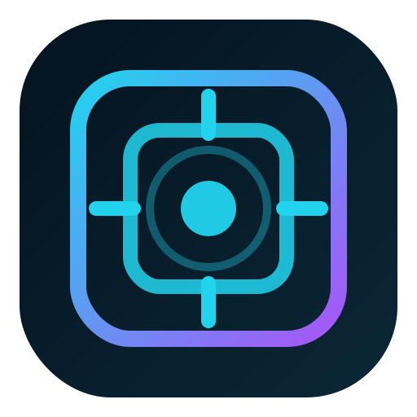

<p align="center">
  
</p>

<h1 align="center">✦ MacVdesktop ✦</h1>

<p align="center">
  <strong>⋆｡°✩ 原生遥测舱 / Truthful Telemetry Chamber ✩°｡⋆</strong>
  <br />
  面向 Apple Silicon / macOS 的真实宿主遥测桌面应用
</p>

<p align="center">
  ╭────────────── ✦ ──────────────╮<br />
  真实采集 · 原生宿主 · 状态诚实 · 可验证扩展<br />
  ╰────────────── ✦ ──────────────╯
</p>

---

## 产品简介

MacVdesktop 不是一个“看起来像遥测”的演示面板，而是一个真正围绕 **真实性** 设计的桌面产品原型：

- **有真实数据，就展示真实数据**
- **暂时采不到，就明确展示 `unavailable / loading / error`**
- **不拿估算值、假值、演示值去填画面**

它把 Tauri v2、Rust、macOS 原生接口与一个高密度的“遥测舱”界面结合起来，让视觉风格服务于产品语义，而不是反过来用视觉掩盖数据边界。

> 这个项目展示的是“真实可得的宿主状态”，不是“想象中的未来遥测面板”。

---

## ✦ 为什么这个产品有意思

### 1. 看起来是科幻舱室，底层却很保守

界面可以很酷，但数据语义必须老实。
如果一个指标在当前主机上拿不到可信来源，它就应该被明确标为不可用，而不是被包装成“差不多像真的”。

### 2. 前端和原生宿主之间有清晰边界

前端不直接猜测宿主状态，而是消费统一快照；宿主采集能力增强时，界面可以直接受益，不需要推翻重做。

### 3. 对 Apple Silicon 场景是真正可落地的

当前仓库已经接入了多条真实宿主链路，包括 AppleSMC、powermetrics helper、macOS 系统 API 等，不再只是一个空壳 UI。

---

## ✦ 产品亮点

- ✦ **原生遥测舱界面**：围绕中心舱室、巡检角色、指标卡片构建高密度视觉空间
- ✦ **真实宿主采集**：CPU、内存、磁盘、网络、热状态、风扇、功耗等指标来自宿主侧真实链路
- ✦ **高权限采集接入**：对需要授权的链路使用系统级授权流程，而不是在前端收系统密码
- ✦ **状态诚实表达**：`live / loading / unavailable / error` 有明确边界
- ✦ **全屏中心集群自适应**：全屏时中心 9 宫格会放大并保持居中，尽量填满中心可视区域
- ✦ **正式 macOS 打包**：支持产出 `.app` 与 `.dmg`，并包含正式应用图标

---

## 能力概览

### 运行模式

| 运行模式 | 当前行为 | 说明 |
| --- | --- | --- |
| 浏览器开发模式 | 渲染完整遥测舱 UI，但宿主指标保持回退 / 不可用状态 | 用于验证前端界面与交互，不伪造宿主数据 |
| Tauri 桌面宿主 | 返回真实宿主遥测快照 | 用于原生采集、授权链路与桌面行为验证 |

### 当前已覆盖的宿主指标

| 模块 | 当前来源 | 备注 |
| --- | --- | --- |
| CPU 簇 | 每核心 CPU tick + perf-level 拓扑 | 真实采样 |
| 内存压力 | VM statistics + memorystatus | 真实采样 |
| 磁盘占用 | 启动卷 / 主卷 | 真实采样 |
| 网络吞吐 | 累计接口计数差值 | 真实采样 |
| 高占用进程 | `sysinfo` 进程刷新 | 真实采样 |
| 热状态 | `NSProcessInfo.thermalState` | 真实采样 |
| 风扇转速 | AppleSMC | 真实采样 |
| 功耗 | `powermetrics` / helper | 真实采样 |
| GPU 活动 | `powermetrics` + Metal 路径 | 可 live，拿不到可信路径时继续诚实降级 |

---

## 产品原则

### 1. 真实性优先于观感完整

项目明确拒绝以下做法：

- 用静态假数据填充原生指标
- 用推断值冒充实测值
- 用无依据动画暗示不存在的宿主变化
- 为了截图好看模糊 `live` 与 `unavailable` 的语义区别

### 2. 降级必须可解释

任何失败都不应该被吞掉。权限缺失、宿主不可用、采样不足、路径未实现，都应该在界面上给出明确反馈。

### 3. 视觉服务于数据，而不是掩盖数据

MacVdesktop 的“小星星、曲线、舱室结构、巡检角色”是产品语言的一部分，但最终都必须服从数据真实性。

---

## 架构概览

### 表现层

`src/components/*`

负责遥测舱界面、模块卡片、指标详情面板、巡检角色与视觉编排。

### 领域层

`src/domain/telemetry/*`

负责快照结构、浏览器回退快照、指标历史、摘要逻辑、布局常量与中心集群缩放计算。

### 集成层

`src/integrations/telemetry/*`

通过 provider 模式分离浏览器回退实现与 Tauri 宿主实现：

- 浏览器环境：返回明确的回退快照
- Tauri 环境：通过 `invoke(...)` 获取原生快照与 helper 状态

### 原生宿主层

`src-tauri/src/telemetry.rs`

负责真正的宿主数据采集、状态降级、指标组装与告警表达，是“真实性边界”的核心实现。

---

## 技术栈

### 前端

- React 19
- TypeScript
- Vite
- Tailwind CSS 4
- Vitest + Testing Library

### 桌面宿主

- Tauri v2
- Rust
- `sysinfo`
- macOS Foundation / Metal
- AppleSMC
- `powermetrics`
- 高权限 helper 链路

---

## 本地开发

### 安装依赖

```bash
npm install
```

### 启动前端开发环境

```bash
npm run dev
```

### 启动 Tauri 桌面壳层

```bash
npm run tauri:dev
```

### 运行前端测试

```bash
npm run test -- --run
```

### 运行 TypeScript 校验

```bash
npm run lint
```

### 运行 Rust 原生测试

```bash
cargo test --manifest-path src-tauri/Cargo.toml
```

---

## 正式打包

### 构建正式包

```bash
npm run tauri:build
```

默认会输出：

- `.app`
- `.dmg`

常见位置：

```text
src-tauri/target/release/bundle/macos/
src-tauri/target/release/bundle/dmg/
```

---

## 目录结构

```text
MacVdesktop/
├─ src/
│  ├─ components/              # 遥测舱界面、卡片、面板、巡检角色
│  ├─ domain/telemetry/        # 快照、摘要、布局、浏览器回退、缩放逻辑
│  ├─ hooks/                   # 数据装配、轮询、状态处理
│  ├─ integrations/telemetry/  # 浏览器 / Tauri provider
│  └─ lib/                     # 运行时与辅助逻辑
├─ src-tauri/
│  ├─ icons/                   # 正式打包图标资源
│  ├─ src/
│  │  ├─ lib.rs                # Tauri command 注册入口
│  │  ├─ telemetry.rs          # 原生遥测采集与快照组装
│  │  └─ apple_smc.rs          # AppleSMC 风扇采集
│  └─ powermetrics_helper.py   # 高权限 powermetrics helper
└─ README.md
```

---

## 当前阶段结论

这个仓库已经不是一个“只做视觉壳”的项目，而是一个带真实宿主边界的桌面产品骨架：

- 前端已能稳定消费统一快照结构
- 浏览器环境会诚实回退
- Tauri 宿主已具备一批真实指标采集能力
- 对于仍需宿主条件或授权的部分，系统会保守降级而不是伪装完成
- 正式 macOS 打包链路已经可用，并包含应用图标

这意味着后续可以继续沿着**真实采集链路**和**产品体验细化**往前推进，而不是围绕“如何让假数据更像真的”继续堆砌。

---

## 下一步建议

1. 继续增强 Apple Silicon 专属采集链路
2. 进一步收紧 GPU / 功耗 / 热状态等信号语义边界
3. 补强宿主侧验证与更多降级路径测试
4. 继续优化舱室视觉密度与正式包体验

---

<p align="center">
  ◜──────────── ✦ MacVdesktop ✦ ────────────◝
  <br />
  <strong>真实可得的宿主状态，才值得被展示。</strong>
  <br />
  ◟──────────── ✦ Truthful by design ✦ ────────────◞
</p>
